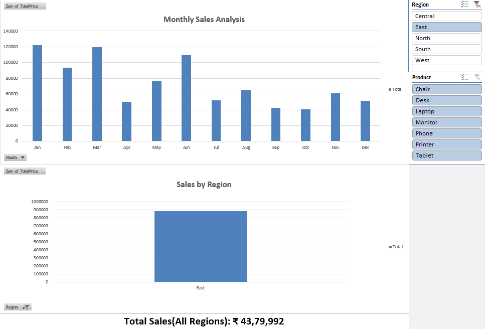

📊 Excel Sales Dashboard

📌 Project Overview

This project is an interactive Sales Dashboard built using Microsoft Excel.

It helps analyze:

- Monthly Sales Performance
- Region-wise Sales
- Product-wise filtering using slicers

---

🛠 Tools Used

- Microsoft Excel
- Pivot Tables
- Pivot Charts
- Slicers

---

📈 Features

- Dynamic filtering by Region & Product
- Monthly sales trend visualization
- Region-wise comparison
- Clean and interactive dashboard

---

📷 Dashboard Preview

---

🚀 How to Use

1. Open the Excel file
2. Use slicers (Region / Product)
3. Analyze sales dynamically

---

📁 File Included

- Sales_Dashboard_Excel.xlsx

---

👨‍💻 Author

Pravin
